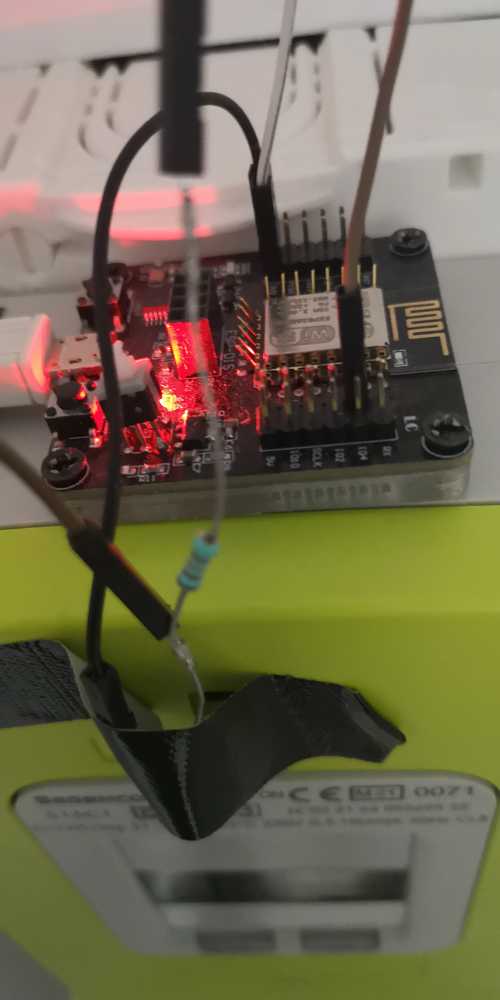
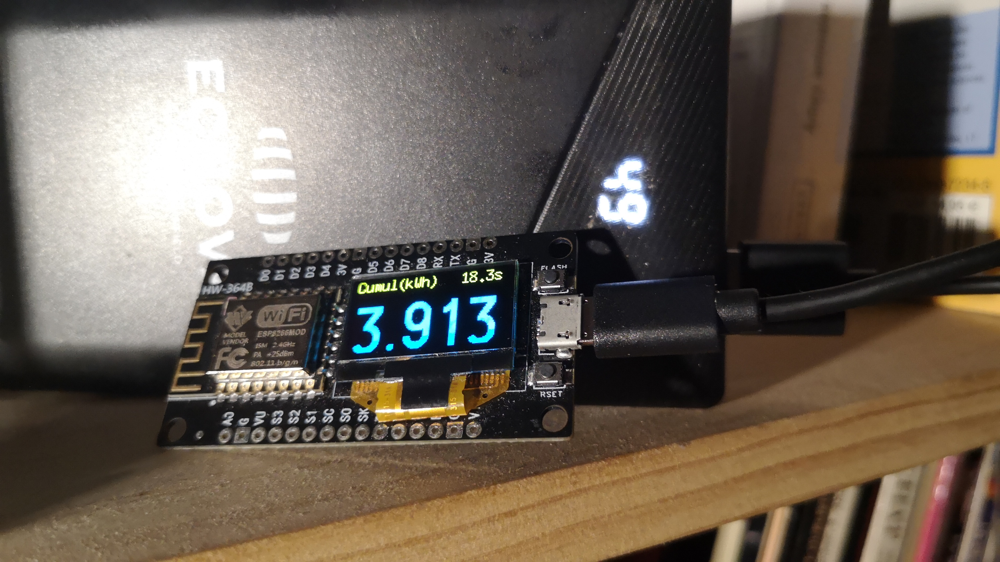

# esp12e_linky_conso_day

Le dispositif se compose de 2 modules :

- Module de détection et de comptage de l'allumage du voyant LED sur le compteur LINKY basé sur un ESP8266 :

  Ce module utile une photo-transistor (plaqué sur la LED en face avant du compteur) et en série avec une résistance de quelques dizaines de kiloOhms pour détecter l'allumage de la LED (à chaque fois 1 watt est consommé). Sur mon module, GPIO 14 sur pin D5 relié au collecteur du photo transistor avec émetteur à la masse. La résistance 47kohm au 3V3.

   3V3 ------ 47kOhm ------ pin D5 (GPIO 14) ----- C photo transistor E ----- Masse
  

  Ensuite il envoie vers un broker MQTT les topics comme :

    - elapsedTime : intervalle entre 2 allumages LED Linky,
    - power : conso intantanée en kWh 
    - cumul : cumul des watts depuis minuit
    - beep : si l'intervalle est inférieure à 1sec. (beep)

  

  

  

- Module d'affichage du cumul de watts consommé depuis minuit basé sur un ESP12E avec affichage OLED :

  Ce module est un ESP12E avec affichage OLED qui va permettre de recevoir du broker MQTT le topic "cumul de watts" et ainsi d'afficher la valeur.

  On peut ajouter un buzzer et utiliser le topic 'beep' pour signaler une conso de plus d'un watt à la seconde ! (topic 'elapsedTime' < 1sec)

  

Note :

Le broker MQTT local peut être activé sur des box Android par une application ou sur un Raspberry Pi !

